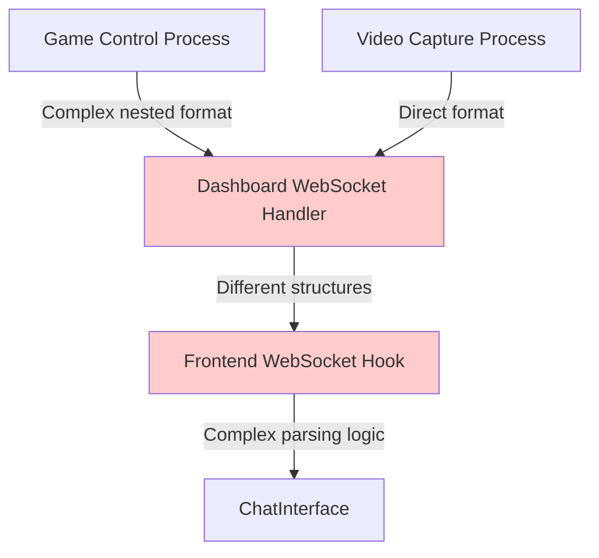
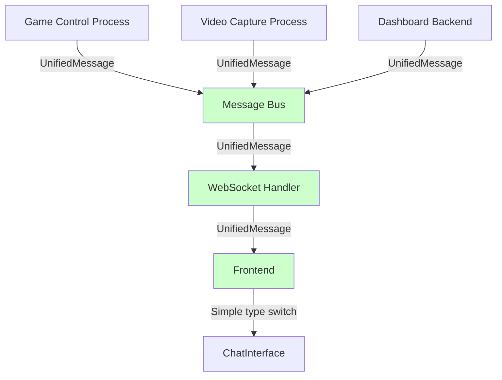

# Simplified Messaging Architecture Design

## Current State Analysis

### Problem Overview
The current messaging system has multiple inconsistent message flows that cause AI responses and button sequences to be lost while GIF messages work correctly. The architecture suffers from:

1. **Multiple Message Formats**: Different processes use different message structures
2. **Complex Nested Parsing**: Frontend has overly complex nested data extraction
3. **Inconsistent Routing**: Messages follow different paths depending on type
4. **Lost Messages**: AI responses and actions get dropped in parsing layers

### Current Message Flow Issues



**Issues:**
- Game Control sends: `chat_message.data.message.content.response`
- Video Capture sends: `chat_message.data.gif`  
- Frontend tries to handle multiple nested structures
- Messages get lost in complex parsing logic

## Proposed Simplified Architecture

### Core Design Principles

1. **Single Message Format**: All messages use the same structure
2. **Direct Routing**: No message transformation between processes
3. **Type-Based Handling**: Simple switch on message type
4. **Consistent Timestamps**: Unified timestamp format across all messages

### Unified Message Format

```typescript
interface UnifiedMessage {
  id: string;                    // Unique message identifier
  type: 'gif' | 'response' | 'action' | 'system';
  timestamp: number;             // Unix timestamp in seconds
  source: 'game_control' | 'video_capture' | 'dashboard';
  sequence?: number;             // Optional sequence for ordering
  content: MessageContent;       // Type-specific content
}

interface MessageContent {
  gif?: GifContent;
  response?: ResponseContent;
  action?: ActionContent;
  system?: SystemContent;
}
```

### Simplified Message Flow



## Implementation Plan

### Phase 1: Message Format Standardization

#### 1.1 Create Unified Message Types
```python
# core/message_types.py
from dataclasses import dataclass
from typing import Optional, Union, Dict, List
import time
import uuid

@dataclass
class UnifiedMessage:
    id: str
    type: str  # 'gif', 'response', 'action', 'system'
    timestamp: float
    source: str
    content: Dict
    sequence: Optional[int] = None
    
    @classmethod
    def create_gif_message(cls, gif_data: str, metadata: Dict, source: str = "video_capture"):
        return cls(
            id=f"gif_{int(time.time() * 1000)}_{uuid.uuid4().hex[:8]}",
            type="gif",
            timestamp=time.time(),
            source=source,
            content={
                "gif": {
                    "data": gif_data,
                    "metadata": metadata,
                    "available": True
                }
            }
        )
    
    @classmethod
    def create_response_message(cls, text: str, reasoning: str = None, processing_time: float = None, source: str = "game_control"):
        return cls(
            id=f"response_{int(time.time() * 1000)}_{uuid.uuid4().hex[:8]}",
            type="response", 
            timestamp=time.time(),
            source=source,
            content={
                "response": {
                    "text": text,
                    "reasoning": reasoning,
                    "processing_time": processing_time,
                    "confidence": 0.95  # Default confidence
                }
            }
        )
    
    @classmethod
    def create_action_message(cls, buttons: List[str], durations: List[float], button_names: List[str] = None, source: str = "game_control"):
        return cls(
            id=f"action_{int(time.time() * 1000)}_{uuid.uuid4().hex[:8]}",
            type="action",
            timestamp=time.time(), 
            source=source,
            content={
                "action": {
                    "buttons": buttons,
                    "button_names": button_names or buttons,
                    "durations": durations
                }
            }
        )
```

#### 1.2 Create Message Bus Service
```python
# core/message_bus.py
import asyncio
import json
from typing import Set, Callable
from .message_types import UnifiedMessage

class MessageBus:
    """Central message bus for all system communication"""
    
    def __init__(self):
        self.subscribers: Set[Callable] = set()
        
    def subscribe(self, handler: Callable):
        """Subscribe to receive all messages"""
        self.subscribers.add(handler)
        
    def unsubscribe(self, handler: Callable):
        """Unsubscribe from messages"""
        self.subscribers.discard(handler)
        
    async def publish(self, message: UnifiedMessage):
        """Publish message to all subscribers"""
        for handler in self.subscribers:
            try:
                if asyncio.iscoroutinefunction(handler):
                    await handler(message)
                else:
                    handler(message)
            except Exception as e:
                print(f"Error in message handler: {e}")
    
    def publish_sync(self, message: UnifiedMessage):
        """Synchronous publish for non-async contexts"""
        asyncio.create_task(self.publish(message))

# Global message bus instance
message_bus = MessageBus()
```

### Phase 2: Process Integration

#### 2.1 Game Control Process Updates
```python
# game_control_process.py - Updated methods
from core.message_types import UnifiedMessage
from core.message_bus import message_bus

class GameControlProcess:
    def _send_response_to_dashboard(self, response_text: str, reasoning: str = None, processing_time: float = None):
        """Send AI response using unified message format"""
        message = UnifiedMessage.create_response_message(
            text=response_text,
            reasoning=reasoning,
            processing_time=processing_time
        )
        message_bus.publish_sync(message)
        
    def _send_action_to_dashboard(self, buttons: List[str], durations: List[float], button_names: List[str] = None):
        """Send action using unified message format"""
        message = UnifiedMessage.create_action_message(
            buttons=buttons,
            durations=durations,
            button_names=button_names
        )
        message_bus.publish_sync(message)
```

#### 2.2 Video Capture Process Updates
```python
# video_capture_process.py - Updated GIF sending
def send_gif_to_dashboard(self, gif_data: str, metadata: Dict):
    """Send GIF using unified message format"""
    message = UnifiedMessage.create_gif_message(
        gif_data=gif_data,
        metadata=metadata
    )
    message_bus.publish_sync(message)
```

#### 2.3 Dashboard WebSocket Handler Simplification
```python
# dashboard/backend/websocket_handler.py - Simplified handler
class DashboardWebSocketHandler:
    def __init__(self, connection_manager: ConnectionManager):
        self.connection_manager = connection_manager
        # Subscribe to message bus
        message_bus.subscribe(self._handle_unified_message)
    
    async def _handle_unified_message(self, message: UnifiedMessage):
        """Handle unified message from message bus"""
        # Convert to WebSocket message format
        ws_message = {
            "type": "chat_message",
            "timestamp": message.timestamp,
            "data": message.__dict__  # Direct serialization
        }
        
        await self.connection_manager.broadcast_message(ws_message)
        
        # Log based on message type
        if message.type == "gif":
            logger.info(f"📤 Broadcasted GIF message: {message.id}")
        elif message.type == "response":
            logger.info(f"📤 Broadcasted AI response: {message.id}")
        elif message.type == "action":
            logger.info(f"📤 Broadcasted action message: {message.id}")
```

### Phase 3: Frontend Simplification

#### 3.1 Simplified WebSocket Hook
```typescript
// dashboard/frontend/src/hooks/useWebSocket.ts - Simplified parsing
const handleMessage = useCallback((message: WebSocketMessage) => {
  console.log('📥 Received message:', message.type);

  switch (message.type) {
    case 'chat_message':
      // Direct deserialization - no nested parsing needed
      const unifiedMessage = message.data as UnifiedMessage;
      
      if (unifiedMessage && unifiedMessage.id && unifiedMessage.type) {
        console.log('💬 Processing unified message:', unifiedMessage.type, unifiedMessage.id);
        
        // Convert to frontend ChatMessage format
        const chatMessage: ChatMessage = {
          id: unifiedMessage.id,
          type: unifiedMessage.type,
          timestamp: unifiedMessage.timestamp,
          sequence: unifiedMessage.sequence || 0,
          content: unifiedMessage.content
        };
        
        // Add to storage and update state
        const updatedMessages = addMessageToStorage(chatMessage);
        setMessages(updatedMessages);
        
        console.log('✅ Message processed successfully:', unifiedMessage.id);
      } else {
        console.error('❌ Invalid unified message:', unifiedMessage);
      }
      break;
      
    // Other message types remain the same
    default:
      console.log('ℹ️ Unknown message type:', message.type);
  }
}, []);
```

#### 3.2 ChatInterface Remains Unchanged
The ChatInterface component doesn't need changes since it already handles the correct message types.

## Benefits of Simplified Architecture

### 1. **Reduced Complexity**
- Single message format eliminates parsing complexity
- Direct routing reduces transformation layers
- Type-based handling is straightforward

### 2. **Better Reliability** 
- Messages can't get lost in nested parsing
- Consistent format across all processes
- Easy to debug message flow

### 3. **Improved Maintainability**
- Single source of truth for message types
- Centralized message bus for routing
- Clear separation of concerns

### 4. **Enhanced Debugging**
- Unified logging format
- Easy to trace messages through the system
- Clear message lifecycle

### 5. **Future Extensibility**
- Easy to add new message types
- Message bus supports multiple subscribers
- Clean integration points for new processes

## Migration Strategy

### Step 1: Implement Core Components
1. Create `core/message_types.py`
2. Create `core/message_bus.py`
3. Add unified message creation methods

### Step 2: Update Producers
1. Update Game Control Process message sending
2. Update Video Capture Process message sending
3. Test each producer individually

### Step 3: Update Dashboard Handler
1. Simplify WebSocket handler to use message bus
2. Remove complex message transformation logic
3. Test message routing

### Step 4: Update Frontend
1. Simplify WebSocket hook parsing
2. Remove nested data extraction
3. Test message display

### Step 5: Cleanup
1. Remove old message handling code
2. Update configuration if needed
3. Update documentation

## Testing Strategy

### Unit Tests
- Test unified message creation
- Test message bus publish/subscribe
- Test message serialization/deserialization

### Integration Tests
- Test end-to-end message flow
- Test all message types (gif, response, action)
- Test message ordering and timestamps

### Performance Tests
- Measure message latency
- Test with high message volume
- Monitor memory usage

## Risk Mitigation

### Backward Compatibility
- Implement feature flags for gradual migration
- Keep old message handlers during transition
- Rollback plan if issues occur

### Data Loss Prevention
- Comprehensive logging during migration
- Message validation at each step
- Automated testing before deployment

### Performance Impact
- Message bus adds minimal overhead
- Direct routing is more efficient than current system
- Reduced parsing complexity improves performance

## Success Metrics

1. **Reliability**: 100% of AI responses and actions appear in dashboard
2. **Performance**: < 50ms message latency end-to-end
3. **Maintainability**: < 50 lines of code for adding new message types
4. **Debugging**: Complete message traceability with unified logging

This simplified architecture will solve the current messaging issues while providing a robust foundation for future enhancements.